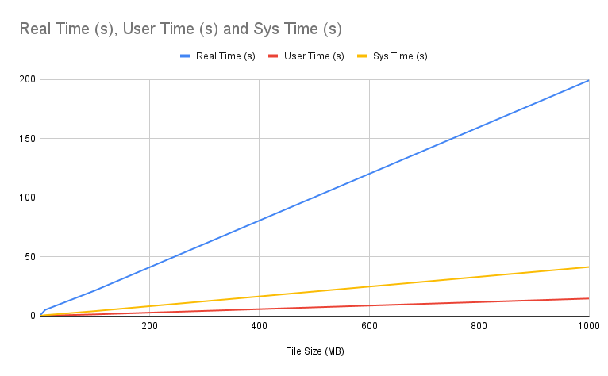

## Transfer Times
Using various sizes of blank binary files, I tested the transfer times of the server to the client with:
```
time ./client -f test.bin
```
The `time` command breaks down the runtime of the command into userspace code executions, system calls, and real elapsed time.

The `test.bin` files were generated with:
```
dd if=/dev/zero of=BIMDC/test.bin bs=1024k count=<count>
```
### 1 MB file
```
real    0m0.531s
user    0m0.031s
sys     0m0.128s
```
### 10 MB file
```
real    0m5.176s
user    0m0.230s
sys     0m0.688s
```
### 100 MB file
```
real    0m21.439s
user    0m1.305s
sys     0m4.111s
```
### 1 GB File
```
real    3m19.370s
user    0m14.754s
sys     0m41.445s
```



## Reflection
Throughout every example each time output scales linearly with the size of the file, meaning that the file transfer is O(n).

Looking at the time category breakdowns it is immedietly obvious that the sum of the `user` and `sys` times do not add up to `real` time, this means that the program spends most of its time waiting rather than executing code. Of the code execution time there is more `sys` calls than `user` calls showing how most of the runtime is from accessing system APIs.

The large portion of the program spent waiting is probably due to waiting for I/O retrievals from disk which can take a long time compared to normal operations in RAM.